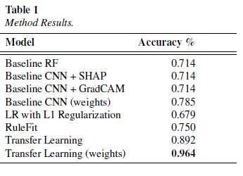
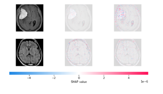

# Providing Doctors with Transparent Predictions: Interpretable Versus Explainable Methods in Brain Tumor Classification
This is a GitHub Repository for a comparison of various inherently interpretable and explainable post-hoc methods for tumor classification. The analyses were conducted as part of an assignment for Machine Learning in Healthcare at ETH Zürich.

## Background
* For the **adoption of clinical AI predictions** by doctors, insights into how the model works and why certain predictions are given is crucial.
* XAI which shed light into model predictions can be split into **interpretable (intrinsically interpretable)** and **explainable (posthoc) methods**. Crucially, **no structured comparison of methods** have been implemented so far.

## Objective
* **Implement a series of XAI methods** and record their **performance in tumor classification on the Kaggle Brain Tumor Dataset**, which includes images of tumor and non-tumor patients as well as structured radiomics features.
* Determining a method which provides the **optimal tradeoff between performance and interpretability**.

## Approach
* The following methods were selected, covering both simple and more complex methods to provide some variation in performance and interpretability:
  * **Random Forests** with Feature Importance (RF) (Task 1)
  * Convolutional Neural Networks (CNN) with **SHAP values** (Task 2)
  * **Logistic Regression (LR)** with L1 regularization and standardized coefficients (Task 3)
  * **RuleFit** (Task 3)
  * CNNs with **GradCAM** attribution (Task 3)
  * CNNs with **transfer learning** (Task 4)
* The data was split in **80-10-10 training, validation, and test dataset*. Performance was contrasted on the test set.

## Key Results
* Performance **varied significantly between models**, with deep learning methods outperforming the traditional models:

  

* Visual explainers like GradCAM or SHAP provided **intuitive explanations**, which provided solutions with eye validity. Please find a visualization of SHAP predictions for CNNs for tumor and non-tumor patients below:

* In contrast, the **interpretable models provided lists of important features** (or decision-rules), but the radiomics features **require domain expertise** to be informative.
* Consequently, the **ideal method** in regard to performance and explainability is a **combination of transfer-learning on CNNs and SHAP values** as a posthoc method. Evidently, no tradeoff between interpretability and performance needs to be done with this method combination. 

## Installation Instructions
* Install Python 3.10 (e.g., via Anaconda) and an IDE (e.g., PyCharm). 
* The files can be run by python taskname.py. 
* For task 2 on shapley values, the results are obtained in two steps. First the task2_base_cnn.py is run to obtain the model weights which are then sent to the task2_shap_posthoc.py
* The weights reported in the paper are also available. Run python evaluate.py -p "model_name" to get the values on test set. For the results reported in the paper, run with batch_size 128 and initial learning rate of 0.001. model_weights/task4_model_128_0.001_True.pth has the highest accuracy.

